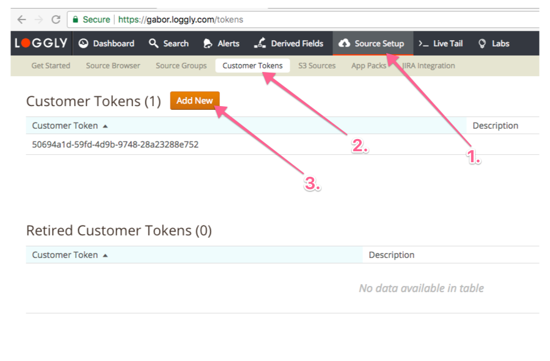

# Loggly extension for WooCommerce logs

Currently supported WooCommerce version: 2.6.x

## Setup

1. Have a loggly account. Sign up at loggly.com
2. Have a customer token. Once you're logged in, go to Source Setup -> Customer tokens -> Add new (or use the one already there)
3. Use that token in WooCommerce -> Settings -> Integrations -> Loggly
4. All good, you should be ready to send logs

